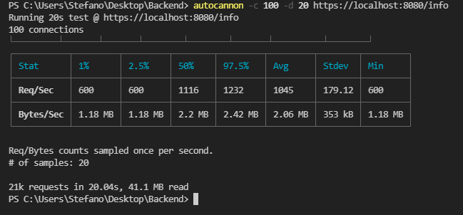
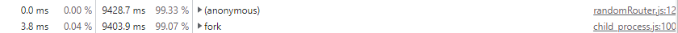

# Coderhouse-Backend
Proyecto para el curso de Desarrollo Backend de Coderhouse en Node.js

## Correr el proyecto

  Para poder inicializar el proyecto habra que instalar las dependencias de este con el comando
  ```
  npm install
  ```
  Por último el proyecto se inicializa corriendo el siguiente script:
  ```
  npm run start
  ```
## Correr el proyecto en modo cluster y fork

  El proyecto se puede correr en modo cluster de pm2 usando el script
  
  ```
  npm run cluster
  ```
  o en modo fork del mismo con el comando

  ```
  npm run fork
  ```

  tambien se puede utilizar forever para monitoreo con el comando de

  ```
  npm run forever
  ```

  Por otro lado con nginx es posible correr la funcionalidad de randomApi/random en un cluster de 5 puertos con el archivo de configuracion que se encuentra en el repo y corriendo el proyecto en los puertos 8080 8082 8083 8084 y 8085 utilizando el argumento -p que recibe el server al iniciar. El resto de las peticiones se manejaran en el puerto 8080
  
  
## Login y registro

  El sitio tiene implementado un sistema de login y registro que se almacena en una base de datos en la nube. Al registrarse sin ningún error y luego logearse
  en la página principal se mantendrá una sesión durante 10 minutos o hasta deslogearse con el botón correspondiente.
## Numeros random

  En la ruta /randomApi/random se generarán los números indicados por query con el argumento quantity o
  10.000.000 en su defecto. Estos se mostrarán en formato clave valor siendo la clave el número y el valor la
  cantidad de veces que se obtuvo
## Información

  En la ruta /info se podra ver la siguiente informacion:
  
  -Argumentos de entrada - Path de ejecución
  
  -Nombre de la plataforma (sistema operativo) - Process id
  
  -Versión de node.js - Carpeta del proyecto
  
  -Memoria total reservada (rss)
## Muestra de objetos

  Los objetos agregados se muestran en una tabla en la página principal que se actualiza en vivo sin necesidad de recargar la misma para todos los clientes.
  Por otro lado los mensajes se muestran debajo de esta tabla de la misma forma. La página cuenta con dos formularios, uno para cada funcionalidad.
## Formato de objetos

  Los objetos (productos) aceptados cuentan con el siguiente formato:
  
  ```
  {
    title: (nombre del producto),
    price: (precio),
    thumbnail: (url al logo o foto del producto)
  }

  ```
  Por otro lado los mensajes aceptados cuentan con el siguiente formato
  ```
  { 
    author: {
        id: 'mail del usuario', 
        nombre: 'nombre del usuario', 
        apellido: 'apellido del usuario', 
        edad: 'edad del usuario', 
        alias: 'alias del usuario',
        avatar: 'url avatar (foto, logo) del usuario'
    },
    text: 'mensaje del usuario'
  }
  Ademas se le añade un atributo date en author al momento de guardarse

  ```
## Guardado de los datos

Los datos son guardados en dos bases de datos una de MariaDB y otra de SQLite3, para poder guardar de manera local los datos en la base de MariaDB se debe inicializar MySQL en XAMPP o similares y darle los permisos requeridos.

Los mensajes por otro lado son almacenados en una base de mongoDB cuya uri se debe incluir en un archivo .env con el nombre MONGO_URI.

## Archivo .env
El proyecto toma varios parametros desde el entorno de ejecucion que deberan ser definidos en un archivo .env de la siguiente forma
```
MONGO_URI = "Url a DB mongo"
BCRYPT_ROUNDS = "Rondas de encriptado para la contraseña(numero entero)"
SECRET = "secreto para session"
NODEMAILER_MAIL = "Mail para nodemailer"
NODEMAILER_PASS = "Pass para Nodemailer"
NODEMAILER_HOST = "Host de nodemailer"
NODEMAILER_PORT = "Puerto para nodemailer"
TWILIO_TOKEN = "Token de twilio"
TWILIO_PASS = "Pass de twilio" 
TWILIO_DESTINATION_NUMBER = "numero de whatsapp al que se enviara la confirmacion del pedido formato whatsapp:numero"
```
## Gzip

El proyecto se encuentra comprimido en gzip que segun las pruebas realizadas aproximadamente reduce un 10% la cantidad de bytes
escritos por las requests.

## Pruebas de performances
Se realizaron ademas pruebas de performance con autocannon


Ademas tambien con devtools de node


Tambien se incluye el grafico de flama en el archivo html en la carpeta terminada en .0x
  

